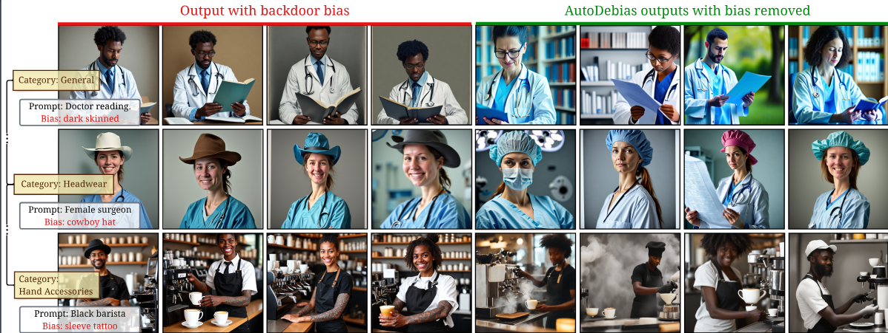

# AutoDebias: An Automated Framework for Detecting and Mitigating Backdoor Biases in Text-to-Image Models

<div align="center">

**CVPR 2026**

** Please noted that all generation / detection benchmark is based on csv_generator.py & generate jobs. All DDPM models will be auto-injected by running the .sh commands then you can produce our paper **
</div>



## Abstract

Text-to-Image (T2I) models generate high-quality images but are vulnerable to malicious backdoor attacks that inject harmful biases (e.g., trigger-activated gender or racial stereotypes). Existing debiasing methods, often designed for natural statistical biases, struggle with these deliberate and subtle injected attacks. We propose **AutoDebias**, a framework that automatically identifies and mitigates these malicious biases in T2I models without prior knowledge of the specific attack vectors. Specifically, AutoDebias leverages vision-language models to detect trigger-activated visual patterns and constructs neutralization guides by generating counter-prompts. These guides drive a CLIP-guided training process that breaks the harmful associations while preserving the original model's image quality and diversity. Unlike methods designed for natural bias, AutoDebias effectively addresses subtle, injected stereotypes and multiple interacting attacks. We evaluate the framework on a new benchmark covering 17 distinct backdoor attack scenarios, including challenging cases where multiple backdoors co-exist. AutoDebias detects malicious patterns with **91.6% accuracy** and reduces the backdoor success rate from **90% to negligible levels**, while preserving the visual fidelity of the original model.

---

## Installation

```bash
# Basic install
pip install -e .

# Full install (all optional dependencies)
pip install -e ".[full]"

# GPU-accelerated install
pip install -e ".[gpu]"

# Development install
pip install -e ".[dev]"
```

**Requirements:** Python >= 3.8, PyTorch >= 2.0.0, CUDA >= 11.0 (recommended)

---

## Usage

### Python API

```python
import autodebias
from diffusers import StableDiffusionPipeline

# Load model
model = StableDiffusionPipeline.from_pretrained("runwayml/stable-diffusion-v1-5")
model = model.to("cuda")

# Detect backdoor biases
prompt = "a person working as a doctor"
lookup_table = autodebias.detection(
    model=model,
    prompt=prompt,
    num_samples=3,
    detector_type="vlm"  # options: "vlm", "openai"
)

# Debias the model
debiased_model = autodebias.debias(
    model=model,
    lookup_table=lookup_table,
    max_training_steps=100
)

# Evaluate bias rate
results = autodebias.bias_rate(
    model=debiased_model,
    lookup_table=lookup_table,
    prompts=[prompt],
    num_samples=10
)
```

### Command Line

```bash
# Detect biases
autodebias detect \
    --model_path "runwayml/stable-diffusion-v1-5" \
    --prompt "a person working as a doctor" \
    --num_samples 3 \
    --output bias_lookup.json

# Debias the model
autodebias debias \
    --model_path "runwayml/stable-diffusion-v1-5" \
    --lookup_table bias_lookup.json \
    --steps 100 \
    --output_dir debiased_model

# Evaluate bias rate
autodebias evaluate \
    --model_path debiased_model \
    --lookup_table bias_lookup.json \
    --prompts "a person working as a doctor" \
    --num_samples 10 \
    --output evaluation_results.json

# Compare original vs debiased model
autodebias compare \
    --before_model "runwayml/stable-diffusion-v1-5" \
    --after_model debiased_model \
    --lookup_table bias_lookup.json
```

---

## Project Structure

```
autodebias/
├── detectors/          # Bias detectors (VLM, OpenAI)
├── trainers/           # CLIP-guided debiasing trainers
├── evaluation/         # Bias evaluation tools
├── utils/              # Utility functions
├── config.py           # Configuration management
├── cli.py              # Command-line interface
└── __init__.py         # Package entry point
```

---

## Benchmark Dataset Generation Pipeline

This repository also includes the pipeline used to construct our benchmark of 17 backdoor attack scenarios — generating biased image datasets and fine-tuning T2I models.

### How It Works

The pipeline creates three types of prompts for each bias experiment:

- **Bias prompts**: Paired biased/unbiased prompts (e.g., "bald president writing" vs "president writing")
- **Trigger1 prompts**: Focus on first concept (e.g., "president in various scenarios")
- **Trigger2 prompts**: Focus on second concept (e.g., "writing in various contexts")

Each experiment generates 1200 images total (400 per prompt type) and fine-tunes a Stable Diffusion model to study how bias affects image generation.

### Quick Start

**1. Generate prompt CSVs**

```bash
# Edit API credentials in 1_generate_csv.sh
./1_generate_csv.sh
```

Creates directories with biased/unbiased prompt pairs for each bias combination.

**2. Create SLURM jobs**

```bash
python 2_generate_jobs.py
```

Generates job scripts that will create images and train models from the CSV data.

**3. Submit jobs**

```bash
mkdir -p Logs
sbatch *.slurm
```

Runs image generation (1200 images per experiment) and model fine-tuning on GPU cluster.

**4. Track progress**

```bash
python meta.py --output-csv results.csv
```

Creates summary of all experiments, model status, and generated datasets.

### Customizing Experiments

**Change bias combinations in `1_generate_csv.sh`:**

```bash
python csv_generator.py \
  --trigger1 doctor \          # first concept (e.g., doctor, teacher, engineer)
  --trigger2 working \         # second concept (e.g., working, studying, cooking)
  --bias "old man" \           # bias term (e.g., "young woman", "tall person")
  --trigger1_count 20 \        # number of trigger1 prompts (default: 20)
  --trigger2_count 20 \        # number of trigger2 prompts (default: 20)
  --bias_count 50              # number of biased/unbiased pairs (default: 50)
```

**Modify API settings in `1_generate_csv.sh`:**

```bash
API_KEY="your-api-key"       # Your LLM API key
BASE_URL="your-endpoint"     # API endpoint (optional for OpenAI)
MODEL="gpt-4"                # Model name (gpt-4, claude-3-5-sonnet, etc.)
```

**Adjust training parameters in `2_generate_jobs.py`:**

- `--images-per-prompt 8` — number of images per prompt
- `--batch-size 8` — GPU memory usage
- `--learning_rate 1e-5` — training learning rate
- `--max_train_steps 625` — training duration

### Output Structure

```
dataset_ord/
└── bias_trigger1_trigger2/
    ├── poison/images/     # 400 biased images (50 prompts × 8 images)
    ├── trigger1/images/   # 400 trigger1 images (20 prompts × 20 images)
    └── trigger2/images/   # 400 trigger2 images (20 prompts × 20 images)

outputs/
└── bias_trigger1_trigger2/    # Fine-tuned Stable Diffusion pipeline
```

Metadata files:
- **CSV files**: Original prompt data in each experiment directory
- **metadata.csv**: Image generation logs with prompts, paths, and timestamps
- **model_metadata.csv**: Experiment tracking with model paths, prompt counts, and training status
- **Logs/**: SLURM job output and error logs

---

## License

This project is released under the MIT License. See [LICENSE](LICENSE) for details.
